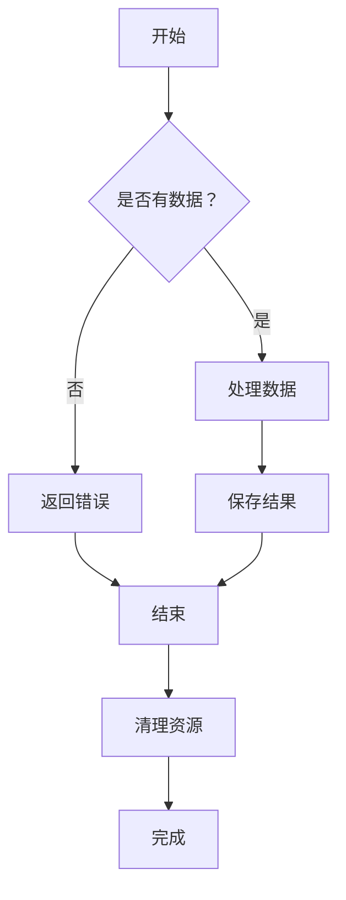
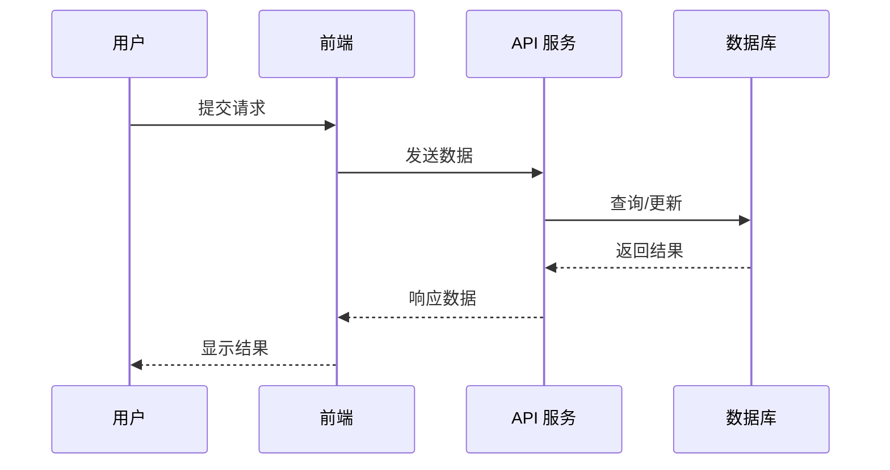
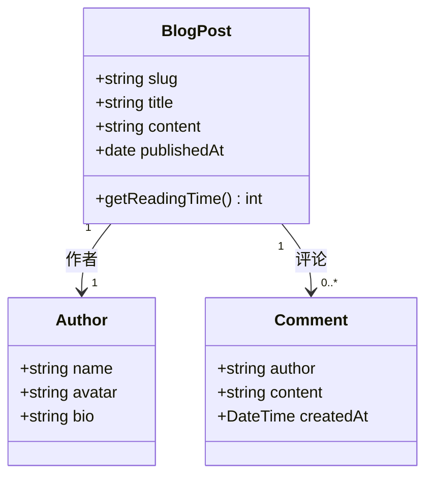
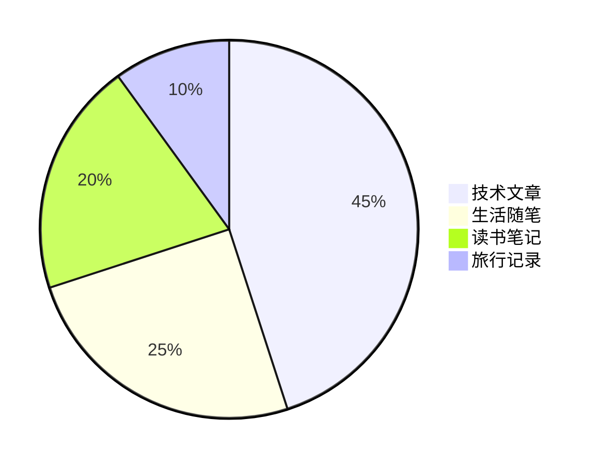

# MDX 功能演示文章

欢迎来到我的博客系统演示文章！本文将展示所有支持的 Markdown 语法、代码高亮效果以及 MDX 组件交互功能。

## 代码块与语法高亮

### JavaScript 代码示例

```javascript
// 异步函数示例
async function fetchData(url) {
  try {
    const response = await fetch(url);
    if (!response.ok) {
      throw new Error(`HTTP error! status: ${response.status}`);
    }
    return await response.json();
  } catch (error) {
    console.error('获取数据失败:', error);
    throw error;
  }
}

// 使用示例
fetchData('https://api.example.com/data')
  .then(data => console.log(data))
  .catch(err => console.error(err));
```

### TypeScript 类型定义

```typescript
interface BlogPost {
  slug: string;
  title: string;
  description: string;
  content: string;
  date: string;
  categories: string[];
  tags: string[];
  cover?: {
    image: string;
    alt: string;
  };
  readingTime: {
    minutes: number;
    words: number;
  };
}

// 泛型函数示例
function mapPosts<T, U>(posts: T[], mapper: (post: T) => U): U[] {
  return posts.map(mapper);
}
```

### Python 代码示例

```python
# 数据处理示例
import pandas as pd
from typing import List, Dict

def analyze_data(data: List[Dict]) -> pd.DataFrame:
    """
    分析数据并返回 DataFrame

    Args:
        data: 字典列表，每个字典代表一条记录

    Returns:
        包含分析结果的 DataFrame
    """
    df = pd.DataFrame(data)

    # 数据清洗
    df = df.dropna()
    df = df.drop_duplicates()

    # 计算统计信息
    stats = {
        'count': len(df),
        'mean': df['value'].mean(),
        'median': df['value'].median(),
    }

    return df, stats

# 使用示例
if __name__ == "__main__":
    sample_data = [
        {"id": 1, "value": 100},
        {"id": 2, "value": 200},
        {"id": 3, "value": 150},
    ]
    result = analyze_data(sample_data)
    print(f"分析结果：{result}")
```

### SQL 查询示例

```sql
-- 复杂查询示例
SELECT
    u.id,
    u.name,
    COUNT(o.id) as order_count,
    SUM(o.total) as total_spent
FROM users u
LEFT JOIN orders o ON u.id = o.user_id
WHERE u.created_at >= '2024-01-01'
GROUP BY u.id, u.name
HAVING COUNT(o.id) > 5
ORDER BY total_spent DESC
LIMIT 10;
```

### Bash 脚本示例

```bash
#!/bin/bash

# 自动化部署脚本
set -e

echo "🚀 开始部署..."

# 构建项目
npm run build

# 运行测试
npm run test

# 部署到 Cloudflare
npm run deploy

echo "✅ 部署完成！"
```

## 文本格式

### 基本格式

这是一段普通的文本。**这是加粗的文字**，*这是斜体文字*，***这是又粗又斜的文字***。

这是~~删除线文字~~，这是<mark>高亮文字</mark>。

这是`行内代码`，适合在句子中引用代码片段。

### 上标和下标

水的化学式是 H<sub>2</sub>O，2 的 10 次方是 2<sup>10</sup> = 1024。

爱因斯坦的质能方程是 E = mc<sup>2</sup>。

葡萄糖的分子式是 C<sub>6</sub>H<sub>12</sub>O<sub>6</sub>。

### Ruby 注音

汉字注音示例：<ruby>汉<rt>hàn</rt></ruby><ruby>字<rt>zì</rt></ruby>。

日文平假名：<ruby>私<rt>わたし</rt></ruby><ruby>達<rt>たち</rt></ruby>。

中文繁体字：<ruby>龍<rt>lóng</rt></ruby><ruby>鳳<rt>fèng</rt></ruby>呈祥。

### 引用块

> 这是一级引用块。
>
> > 这是嵌套的二级引用块。
> >
> > 名人名言：
> > > 编程是一种艺术，而不仅仅是技术。—— 某位程序员

> [!NOTE]
> 这是一个注意块，用于提示重要信息。

> [!TIP]
> 这是一个提示块，提供有用的技巧。

> [!WARNING]
> 这是一个警告块，提醒潜在的问题。

## 列表

### 无序列表

- 第一项
  - 嵌套项 1.1
  - 嵌套项 1.2
    - 更深层嵌套
- 第二项
- 第三项

### 有序列表

1. 第一步：准备工作
2. 第二步：安装依赖
   1. 安装 Node.js
   2. 安装 pnpm
3. 第三步：运行项目
4. 第四步：查看效果

### 任务列表

- [x] 已完成的任务
- [ ] 待完成的任务
- [x] 另一个已完成的任务
- [ ] 另一个待完成的任务

## 表格

### 基础表格

| 名称 | 类型 | 描述 |
|------|------|------|
| title | string | 文章标题 |
| description | string | 文章描述 |
| content | string | 文章内容 |
| date | string | 发布日期 |

### 复杂表格

| API | 方法 | 端点 | 描述 | 状态码 |
|-----|------|------|------|--------|
| 获取文章 | GET | `/api/posts/:id` | 根据 ID 获取文章详情 | 200, 404 |
| 创建文章 | POST | `/api/posts` | 创建新文章 | 201, 400 |
| 更新文章 | PUT | `/api/posts/:id` | 更新文章信息 | 200, 404 |
| 删除文章 | DELETE | `/api/posts/:id` | 删除文章 | 204, 404 |

## 链接和图片

### 链接

这是 [普通链接](https://example.com)，这是 [带标题的链接](https://example.com "点击查看详情")。

这是站内链接：[返回首页](/) 或 [查看博客列表](/blog)。

### 图片


图片说明：上面的图片展示了博客封面效果。

## 水平分割线

上面的内容是一段落，下面是分割线：

---

分割线后可以开始新的章节。

---

## 脚注

这是一段包含脚注的文字[^1]，另一段也有脚注[^2]。

[^1]: 这是第一个脚注的内容。
[^2]: 这是第二个脚注的内容，可以包含多行。

## 定义列表

HTML
: 超文本标记语言

CSS
: 层叠样式表

JavaScript
: 脚本语言，用于网页交互

## 特殊内容块

### 代码块中的注释

```typescript
// 单行注释
const name = "Willin Wang";

/*
 * 多行注释
 * 可以写很多行
 */
interface Config {
  name: string;  // 行内注释
  port: number;  // 端口配置
}
```

### Emoji 表情

博客系统支持 Emoji 表情：🚀 🎉 💻 📝 ✨ 🌟

## 嵌套内容

### 复杂嵌套示例

1. 主列表项一
   - 子项包含**粗体**
   - 子项包含*斜体*
   - 子项包含 `代码`

2. 主列表项二
   > 包含引用块

3. 主列表项三
   ```javascript
   console.log('包含代码块');
   ```

## 流程图

### Mermaid 流程图

博客系统支持使用 Mermaid 语法绘制流程图、时序图、甘特图等。

#### 流程图示例



#### 序列图示例



#### 类图示例



#### 饼图示例



## 摘要结束

感谢你阅读完这篇演示文章！现在你了解了博客系统支持的所有 Markdown 语法、MDX 特性以及流程图绘制功能。

如果你有任何问题或建议，欢迎在评论区留言。

**祝你写作愉快！** ✨
